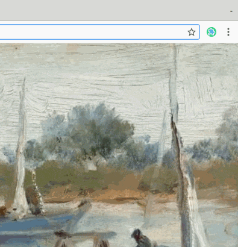

#  One Click Extension Manager

A simple Chrome extension to manage your Chrome extensions.

It only requires the `management` permission.

## Install

[link-chrome]: https://chrome.google.com/webstore/detail/one-click-extension-manag/pbgjpgbpljobkekbhnnmlikbbfhbhmem 'Version published on Chrome Web Store'
[link-firefox]: https://addons.mozilla.org/en-US/firefox/addon/npm-hub/ 'Version published on Mozilla Add-ons'
[link-safari]: https://apps.apple.com/app/npmhub/id1542090429 'Version published on the Mac App Store'

[][link-chrome] [][link-chrome] also compatible with [][link-chrome] [][link-chrome]

## Internationalization (i18n)

It's available in 11 languages:

- English
- Chinese (Simplified)
- Chinese (Traditional)
- Italian
- Spanish
- German
- French
- Korean
- Russian
- Japanese
- Hebrew

You can suggest improvements or new languages using the [web-ext-translator](https://lusito.github.io/web-ext-translator/) web tool:

1. Visit https://lusito.github.io/web-ext-translator/
2. Click the GitHub icon on the top left corner
3. Enter `https://github.com/hankxdev/one-click-extensions-manager`
4. Make changes and submit them to this repo

## License

MIT © [Hank Yang](https://momane.com/), [Federico Brigante](https://github.com/bfred-it/)
