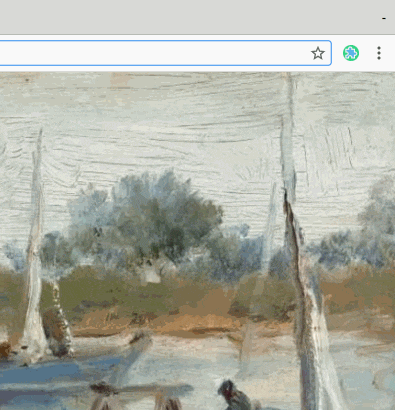

##  OnFire Extensions Manager



<!-- Text wrap helper; Without this, the text can be squished in 40px next to the image -->


OnFire Extensions Manager is a modified fork of One Click Extension Manager,
customized for a more capable local Brave/Chromium workflow.

This fork is the version to use from this repository and locally. It is
visually branded as **OnFire Extensions Manager** so it is easy to distinguish
from the original Chrome Web Store extension.

Current fork additions include:

- Opening other extensions' popups from the manager, including unpinned
  extensions when the native helper is installed.
- Folder organization, search, and compact status filters.
- Enable/disable toggles plus a remove action that uninstalls extensions from
  the browser.
- A compact modern popup UI for local use.
- Cross-platform native helper setup for macOS and Windows.

## Original project credit

This project is based on the original
[One Click Extension Manager](https://github.com/hankxdev/one-click-extensions-manager)
by [Hank Yang](https://momane.com/) and
[Federico Brigante](https://fregante.com/). The original MIT license and
copyright notice are preserved in this repository.

## Install

This fork is intended to be loaded unpacked from this repository, not installed
from the original Web Store listing.

1. Run `npm install` once.
2. Run `npm test` to lint, test, and build `distribution/`.
3. In Brave or Chrome, open `chrome://extensions`.
4. Enable Developer Mode.
5. Load unpacked from this repository's `distribution/` folder.

The installed extension should appear as **OnFire Extensions Manager** with the
custom OnFire logo.

## Native popup helper

The native popup helper is required for the "open another extension's popup"
feature. It supports macOS and Windows.

After loading the unpacked extension, copy this extension's ID from
`chrome://extensions`, then run the cross-platform installer:

```sh
npm run helper:install -- <extension-id> brave
```

Use `chrome` instead of `brave` when installing for Google Chrome. On Windows,
`edge` and `chromium` are also accepted.

Diagnostics and cleanup use the same cross-platform wrappers:

```sh
npm run helper:diagnose -- brave
npm run helper:uninstall
```

Platform-specific scripts remain available under `native-helper/` for users who
prefer direct macOS shell or Windows PowerShell commands.

## Internationalization

It's available in several languages:

- English (United States)
- 中文 (简体)
- 中文 (繁體)
- Italiano
- Deutsch
- Español
- Français
- עברית
- 日本語
- 한국어
- русский
- Türkçe
- Nederlands
- Polski
- Latviešu

You can suggest improvements or new languages using the `web-ext-translator` web tool:

1. Visit https://lusito.github.io/web-ext-translator/?gh=https://github.com/onfire7777/one-click-extensions-manager-V2/tree/main
2. Make changes to your language
3. Open a PR on this repo to submit your changes

## License

MIT © [Hank Yang](https://momane.com/), [Federico Brigante](https://fregante.com/)
